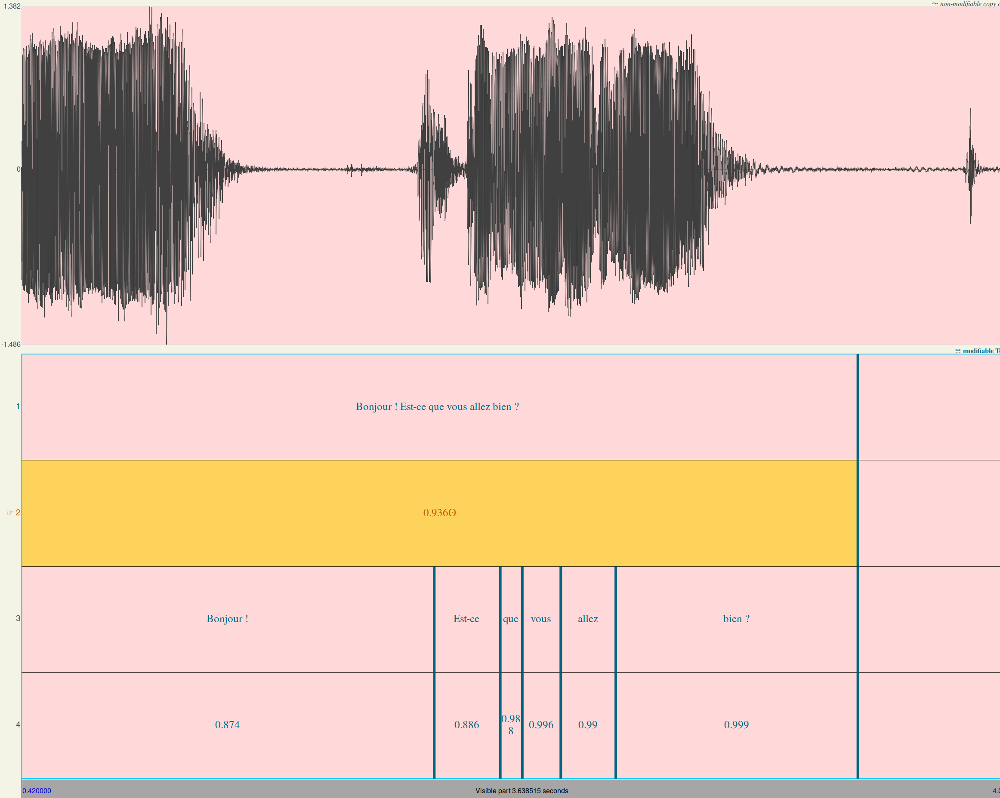

# Transcribe align TextGrid

A small wrapper package around [whisper-timestamped](https://github.com/linto-ai/whisper-timestamped). Create force-aligned transcription TextGrids from raw audio.

## Installation

### Requirements

- `Python3.8` and above.
  - Use the executable `python3.x` on Unix, available in most package managers, or `py -3.x` on Windows.
  - This command line executable will be referred to as `[python-executable]` for the rest of the instructions
  - Install pip on old python versions with `[python-executable] -m ensurepip --default-pip`
- `ffmpeg` Usually preinstalled on Linux. For Windows see instructions for installation on the [whisper repository](https://github.com/openai/whisper)

### Installing Torch

Torch, on which Whisper is built, is quite a low-level library, meaning which version you'll need depends on your OS and type of GPU. On Mac and Windows, pip will by default install a non-accelerated CPU version of the library. If you are on Linux, it will presume you have a CUDA-capable (which is to say Nvidia branded) GPU. If you are on Windows and have an Nvidia GPU you can use, or are on Linux and either do not have a GPU or have an AMD GPU, you should check out the more detailed torch installation instructions [here](https://pytorch.org/get-started/locally/).

This should be done _before_ installing `transcribe_align_textgrid` and `whisper_timestamped`.

### Installing

Once the requirements are satisfied, you can install whisper-timestamped and this package:

```bash
[python-executable] -m pip install transcribe_align_textgrid
```

## Running from the command line

Once the application is installed, you can run it with:

```bash
[python-executable] -m transcribe_align_textgrid [path]
```

here `path` is the path to the audio files.

- If a directory path is passed, all audio files in the directory will be transcribed, and force-aligned transcription TextGrids of the same name will be generated in this directory.
- If a file path is passed, a force-aligned transcription TextGrid will be generated into the same directory with the same name as the original file.
- If a glob is passed, the glob will be resolved and all matches will be processed as if the files were passed individually (So: not only the default shell expansion of `*.wav`, but also shell-escaped versions like `'*.wav'`. This is non-standard, but I needed it for shell scripts)
- By default, if a non-audio file is passed, an error is raised. To skip those instead, pass the `--skip` flag.

### Selecting a different model

By default, this will run on the smallest, that is, least accurate and fastest, model, `tiny`. To run with another model, pass it as an argument:

```bash
[python-executable] -m transcribe_align_textgrid [path] --model [model]
```

The available models are:

|  name  | Parameters | Required VRAM | Relative speed |
| :----: | :--------: | :-----------: | :------------: |
|  tiny  |    39 M    |     ~1 GB     |      ~32x      |
|  base  |    74 M    |     ~1 GB     |      ~16x      |
| small  |   244 M    |     ~2 GB     |      ~6x       |
| medium |   769 M    |     ~5 GB     |      ~2x       |
| large  |   1550 M   |    ~10 GB     |       1x       |

### Specifying what language to use

By default, the application will try to detect what language is used automatically. However, you can also specify this manually:

```bash
[python-executable] -m transcribe_align_textgrid [path] --language [language]

# Or also specifying what model to use:
[python-executable] -m transcribe_align_textgrid [path] --model [model] --language [language]
```

To see what languages are available, please see the [tokenizer.py](https://github.com/openai/whisper/blob/main/whisper/tokenizer.py) file in the Whisper source (Yes, the OpenAI team themselves recommends finding it this way, too.)

## Using as a library

The tool can also be used as a library. It exports one function: `whisper_to_textgrid()` Which takes in a transcription object (nested dictionary) from [whisper-timestamped](https://github.com/linto-ai/whisper-timestamped) and returns a Textgrid object from [praatio](https://github.com/timmahrt/praatIO). The typical Json output from whisper-timestamped works, too.

### Output

The output TextGrids have four TextGridTiers:

- `segments_text` The text in a given segment (Speaker's turn)
- `segments_confidence` The confidence the model has that this is the correct labelling and segmentation for the segment
- `words_text` The text of a given word
- `words_confidence` The confidence the model has that this is the current labelling and segmentation for this word.

If one of these tiers would have been empty per the output of whisper-timestamped, to satisfy Praat's error handling, a tier with an empty interval (0.0, 0.1) is generated.

In praat, it will look a little like this:

<p align="center">
  
</p>

## Development

The package is quite trivial, but, if you want to work on it, here are some instructions

### Style

All code is formatted with the [Black](https://github.com/psf/black) code-formatter.

I am dyslectic, and quite likely to make spelling errors in variables. If you find any, don't hesitate to send me a pull request!

### Running Tests

After cloning the repository, moving into it, install the local version of the package itself and its development dependencies with:

```bash
# Do this in a clean virtual environment to not confuse different versions.
[python-executable] -m pip install -e ".[dev]"
```

After that, this installed version of the package can be tested with:

```bash
[python-executable] -m pytest --cov=transcribe_align_textgrid tests/
```

To test the CLI, there are audio files in `./tests/audio/` to run on. For example:

```bash
[python-executable] -m transcribe_align_textgrid ./tests/audio/*.mp3
```

Since this relies on the stochastic models of Torch, it is not expected that the output between runs is ever fully equal, but they can be visually compared with the expected outputs from the `./tests/expected/` directory.
